# Active Directory Lab

## Overview
This project demonstrates a Windows Server Active Directory environment with domain services, user management, and group policies.

## Objectives
- Deploy AD DS
- Configure users and groups
- Implement Group Policy Objects (GPOs)
- Simulate an enterprise environment

## Environment
- Windows Server 2025
- Windows 11 client
- VirtualBox

## Architecture

## Set Up
Configure virtual machines
- 1 server, 2 Hosts
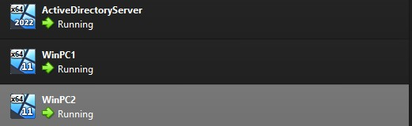

- Configure Private network for Machines
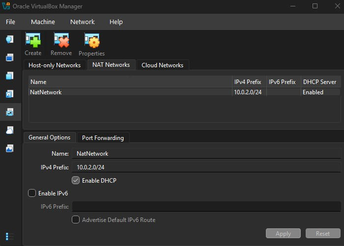

- Add VMHosts to private network
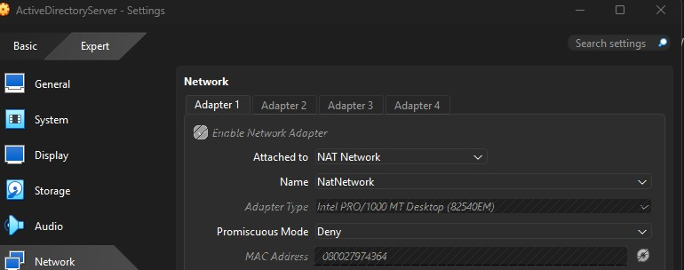

- Set up Advanced Directory by clicking on "Add Roles and Features" in Server Manager
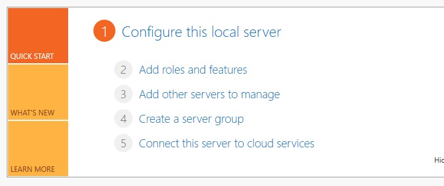

- Go to the "Server Roles" tab and check "Active Directory Domain Services", then continue to install AD
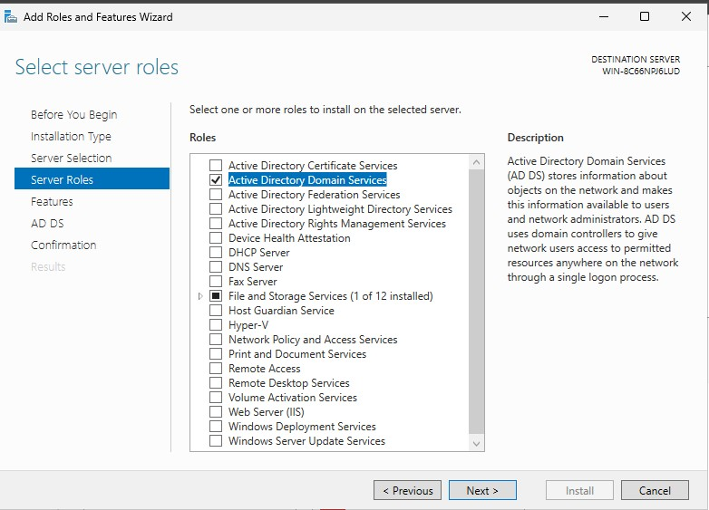

- Afterwards, click on the flag icon on the top right of the screen and promote the server to a Domain Controller
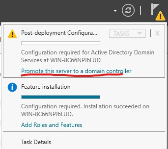

- Create a new forest and create a "Root Domain Name" and Password, then continue and install settings
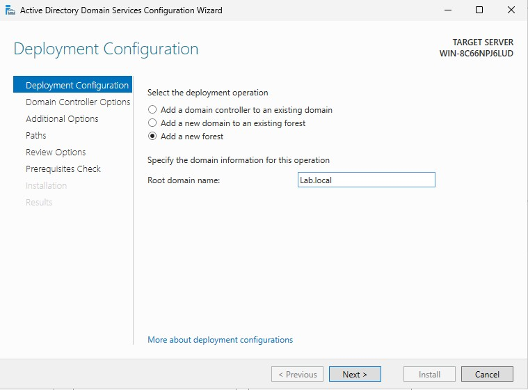

- After rebooting, go to Tools>Active Directory Users and Computers>(Domain name)>Users to create users
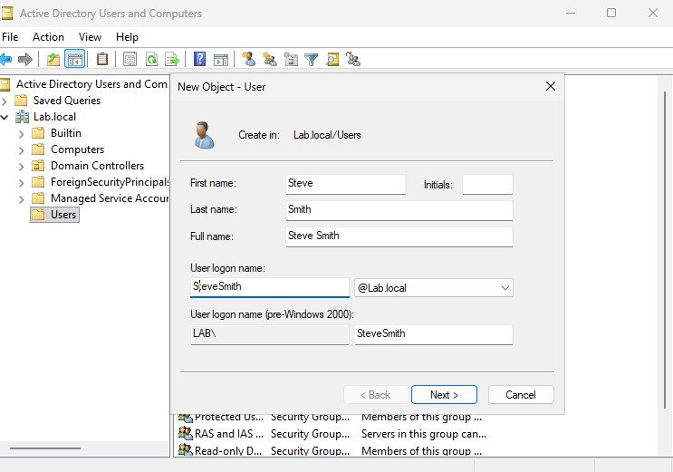

- Now that the server has been set up, go back to the host machines to finish adding them to the domain. Search "Access Work or School"
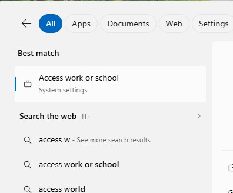

- Click "Join Local Active Directory"
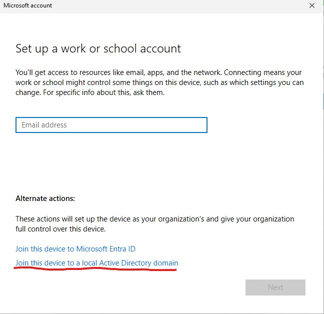

- Enter Root Domain, User's sign-in information, and it's finished
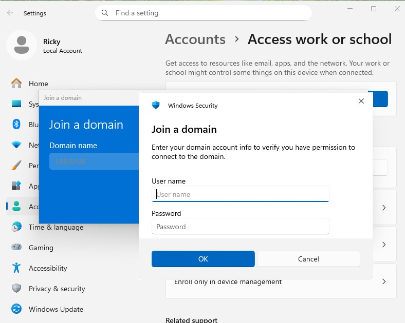
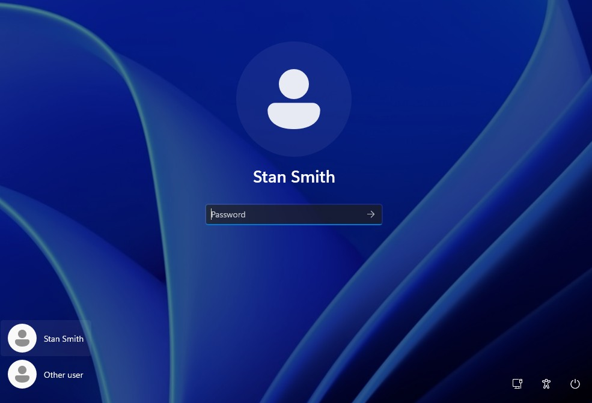
